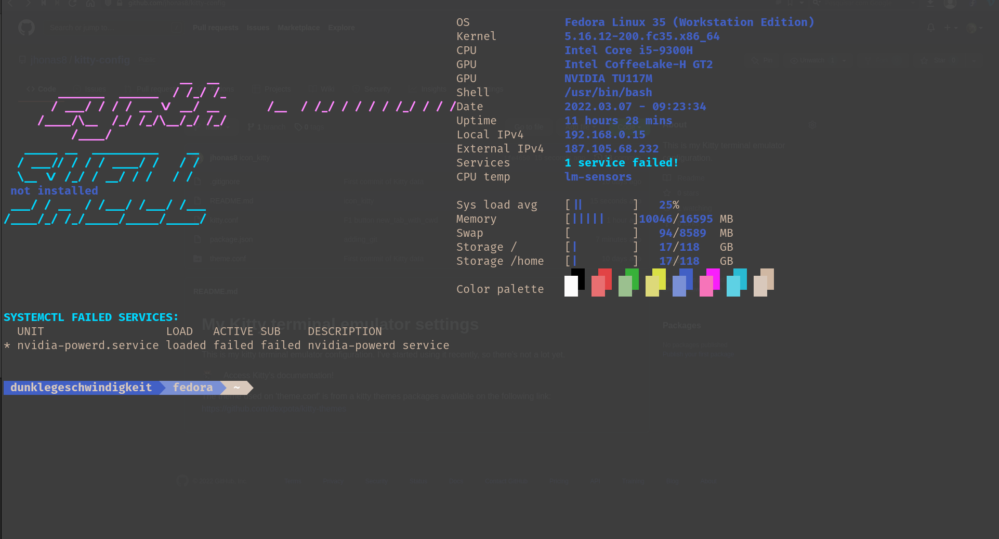

# My Kitty terminal emulator settings #
This is my kitty terminal emulator configuration. I've started using it recently, so there's not a lot yet. 

  

[][kitty-link]
Access Kitty's documentation!

## Theme ##

The theme being used is part of a theme package available on [Github](kitty-link). 

[theme-package]: https://github.com/dexpota/kitty-themes
[kitty-link]: https://sw.kovidgoyal.net/kitty/
